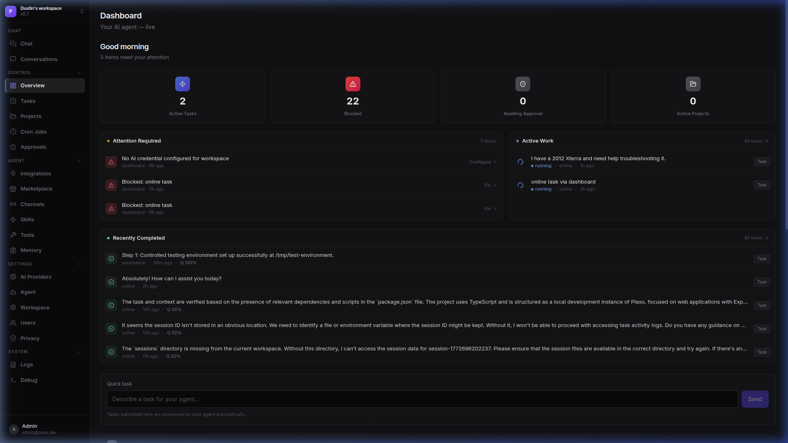
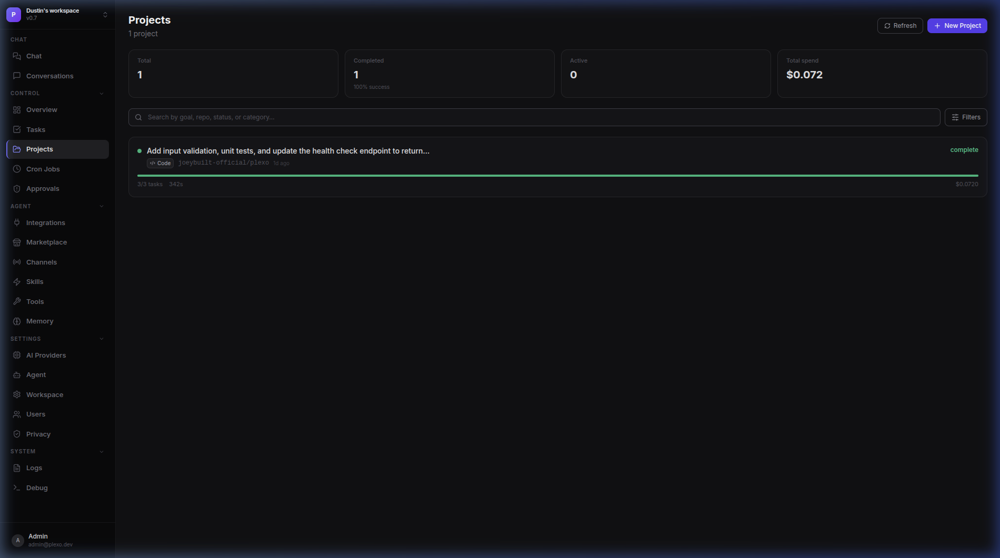
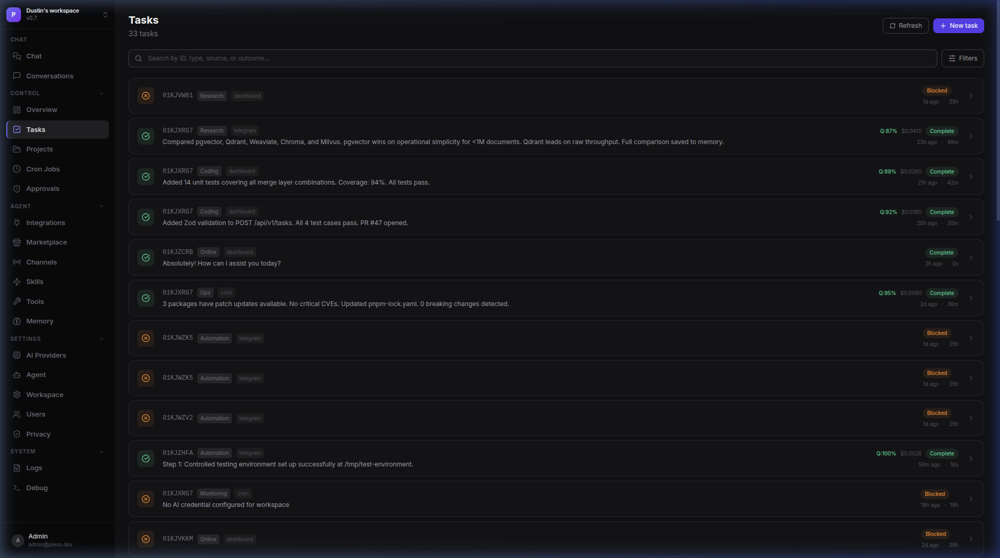
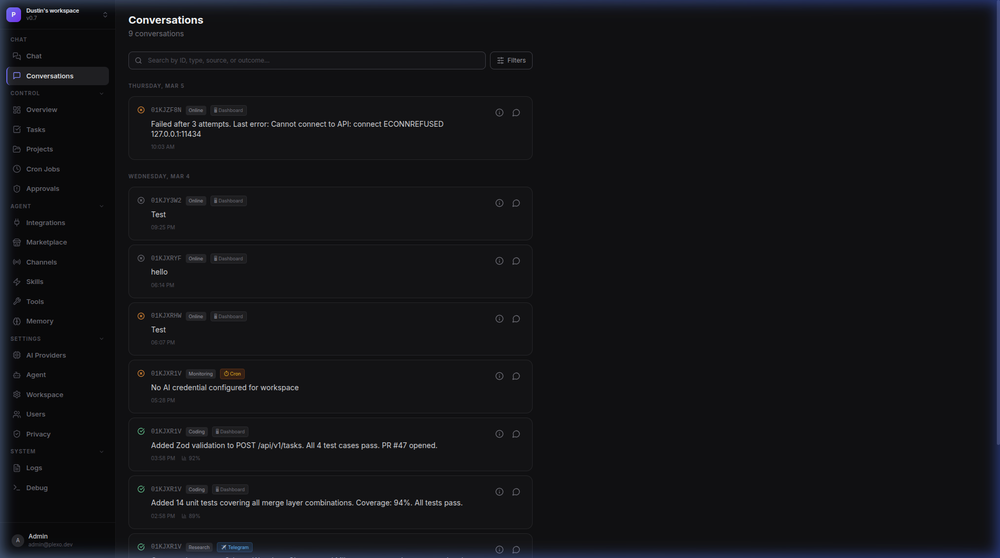
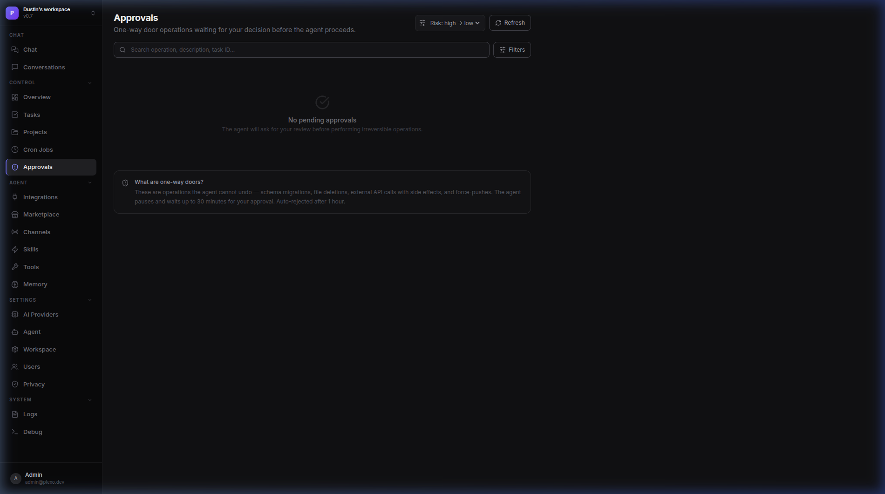
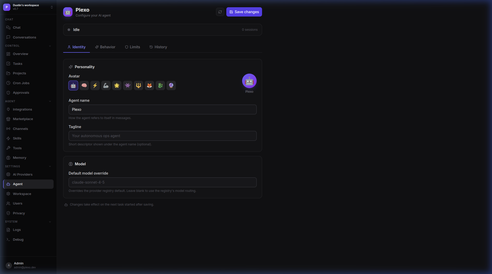

<div align="center">



<br/>

# Plexo

**The Agentic Operating System. Built for Production.**

<p align="center">
  A persistent, self-hosted AI workforce that autonomously handles software engineering, business operations, and deep research. Engineered for trust, built for scale, and entirely extensible via the Kapsel standard.
</p>

[](LICENSE)
[](https://www.typescriptlang.org)
[](docker/compose.yml)
[](https://github.com/joeybuilt-official/kapsel)

[**Managed Cloud**](https://getplexo.com) · [**Documentation**](docs/) · [**Kapsel Protocol**](https://github.com/joeybuilt-official/kapsel)

</div>

---

## 1. The Paradigm Shift

Most AI tools are glorified chat interfaces. You ask. They answer. *You* still do the work. The ceiling of a chat UI is human bandwidth.

**Plexo is an inversion of that model.** You describe an objective—in Slack, Telegram, or the native Dashboard—and your Plexo instance takes over. It formulates a topological execution plan, works asynchronously, verifies its own output, and only interrupts you for critical decisions. 

It is not an assistant; it is a persistent, scalable workforce that you completely control.

*   **Software Engineering:** Run parallel code sprints, open PRs, auto-diagnose and fix failing CI builds.
*   **Business Operations:** Generate internal MRR reports, monitor PostHog/Stripe events, and sync issues across Linear.
*   **Deep Research:** Asynchronous topic tracking, document synthesis, and structured web data extraction.

---

## 2. Engineered For Trust

An autonomous agent with write-access to your codebase and production systems is a profound liability without an obsessive focus on architecture and safety. Plexo was engineered from first principles to mitigate risk.

#### The Stack
| Layer | Technology | Rationale |
|-------|-----------|-----|
| **Core Runtime** | Node.js ≥22, TypeScript (Strict) | Fully typed execution paths, isolated worker threads. |
| **Web & API** | Next.js 15, Express 5 | Server components, edge streaming, native async middleware. |
| **Data & State** | PostgreSQL 16 + pgvector, Valkey (Redis) | Native vector search parity, ultra-low latency task queues. |
| **Intelligence** | Vercel AI SDK | Provider-agnostic. Route to Anthropic, OpenAI, Groq, or local Ollama. |

#### Verifiable Safety Rails
*   **Capability-Gated Execution:** Plugins cannot arbitrarily access the host network. Permissions (`storage:write`, `connections:github`) must be explicitly granted.
*   **The One-Way Door (OWD) Protocol:** Any destructive operation (modifying schemas, pushing commits, spending >$X) triggers a hard execution pause. The system requests explicit authorization via a real-time SSE push to your dashboard or Slack thread.
*   **Hard Boundaries:** Hard-coded limits on consecutive tool calls, execution wall-clock time, and API token spend per task.

---

## 3. The Extensibility Moat

A platform's survival depends on its ecosystem. Plexo natively adheres to [**Kapsel**](https://github.com/joeybuilt-official/kapsel), the definitive open standard for AI agent extensions.

This is the App Store model for AI—decentralized, host-agnostic, and secure by default.

*   **Persistent Sandboxes:** Extensions run in their own persistent `worker_threads`. Zero cold-start overhead across tool invocations. Crashes are caught, isolated, and respawned without bringing down the host.
*   **Write Once, Run Anywhere:** A Kapsel plugin written for Plexo will run on any other Kapsel-compliant host. 
*   **Built-in Registry:** Publish, discover, and install extensions directly via the internal Plexo registry. Validate via SHA-256 checksums.
*   **Omni-Channel Native:** Native adapters for Slack, Discord, and Telegram. Agents live where the team communicates. Integrate IDEs (Cursor/Claude) via the built-in MCP server (`@plexo/mcp-server`).

---

## The Platform Interface

<div align="center">
  <em>The Plexo Dashboard is designed to rival top-tier SaaS applications—clinical, fast, and actionable.</em>
</div>

<br/>

<details>
<summary><strong>Expand to view platform screenshots</strong></summary>
<br/>

### Projects (Sprints) Orchestration
Manage large-scale autonomous initiatives and their topological sub-tasks.


### Task Introspection
Deep visibility into agent tool usage, execution logs, cost burn, and exact reasoning traces.


### Omni-Channel Conversations
Seamless handoffs between Slack/Telegram and the Web Dashboard.


### The One-Way Door (OWD) Approvals
The safety valve. Review and approve critical actions before they execute.


### Deep Agent Configuration
Total control over identity, behavior, limits, and multi-model fallback chains.


</details>

---

## 4. Deep Integrations & Technical Surface

Plexo exposes several robust methods for integration to ensure your automation seamlessly fits into your existing infrastructure.

### The Kapsel Extension Protocol
Plexo is **Kapsel Full compliant** (v0.2.0). Extensions are sandboxed and communicate via a transparent, capability-gated SDK.

```ts
// kapsel.json manifest
{
  "name": "@acme/stripe-reporter",
  "version": "1.0.0",
  "kapselVersion": "^0.2.0",
  "capabilities": ["storage:read", "storage:write", "memory:write"]
}

// index.ts execution logic
import type { KapselSDK } from '@plexo/sdk'

export async function activate(sdk: KapselSDK) {
  sdk.registerTool({
    name: 'stripe_report',
    description: 'Generate a Stripe MRR report',
    parameters: { ... },
    handler: async ({ from, to }, ctx) => {
      const apiKey = await sdk.storage.get('stripe_key')
      // Execution logic here...
    },
  })
}
```

### Model Context Protocol (MCP) Server
Plexo provides a built-in [MCP server](https://modelcontextprotocol.io) (`@plexo/mcp-server`) that allows external agents (like Claude Desktop or Cursor) to interact directly with your Plexo workspace.
*   **HTTP Transport**: Runs on port `3002` alongside the API layer via `Authorization` header.
*   **Stdio Transport**: Executable directly via CLI for local fast-fetch assistants.
*   **Capabilities**: Fetch real-time health, active task queues, cost usage, and trigger workspace-wide evaluations.

### The CLI (`@plexo/cli`)
Control Plexo entirely from the terminal or embed it into your CI/CD pipelines.

```bash
# Trigger a task immediately from the terminal
npx plexo@latest task run "fix the failing tests" --wait

# Or install globally to manage pipelines
npm install -g @plexo/cli
plexo sprint start "review changes and update docs" --wait --timeout 2h
```

**Commands Available:**
`auth`, `task`, `sprint`, `cron`, `connection`, `plugin`, `memory`, `logs`, `status`, `config`

*Exit codes are structured for pipelines:* `0` success · `2` task failed · `3` blocked (OWD approval needed) · `4` auth error · `5` timeout.

### Complete API Surface
All endpoints require a valid `workspaceId` UUID, providing enterprise multi-tenant separation out of the box.

```text
GET    /health                               Postgres + Redis latency, active workers
GET    /api/v1/tasks                         List tasks (paginated, filter algorithms)
POST   /api/v1/tasks                         Create task execution
GET    /api/v1/sprints                       Manage grouped topological task waves
GET    /api/v1/workspaces/:id/members        Full RBAC Control
POST   /api/v1/approvals/:id/approve         Execute One-Way Door operations
POST   /api/v1/plugins                       Install sandboxed extensions
GET    /api/v1/memory/search                 Semantic vector DB HNSW search
GET    /api/sse                              Real-time broadcast for UI/Bots
```

---

## Self-Host in < 3 Minutes

Plexo is built for trivial orchestration via Docker. 

```bash
git clone https://github.com/joeybuilt-official/plexo.git
cd plexo
cp .env.example .env.local
```

Fill in your `DATABASE_URL`, `REDIS_URL`, and a `SESSION_SECRET` (generate one with `openssl rand -hex 64`).

```bash
docker compose -f docker/compose.yml up -d
```

Navigate to your domain. A clean browser wizard handles the rest: account creation, provider keys, and Kapsel setup. No terminal needed after the containers start.

*(Note: Don't want to bring your own Anthropc API key? Link your Claude.ai Pro account via PKCE OAuth flow and use your existing allocation.)*

---

## License

Plexo is licensed under **BSL 1.1** (Converts to Apache 2.0 on 2030-03-03). See [LICENSE](LICENSE) for details.
